<h1 align="center">Pradheep P</h1>

  <strong>CS Undergrad</strong>

  <a href="https://www.pradheep.dev/">Portfolio</a> •
  <a href="https://www.linkedin.com/in/pradheepraop/">LinkedIn</a> •
  <a href="https://x.com/pradheepraop">X</a>

---

<em>messing with rl training on a100s rn — benchmarking efficiency, vram hacks, and ways to speed it up. speculative decoding history in the works too.</em>

Check out the organization we're building: <b>HyperKuvid-Labs</b> → https://github.com/HyperKuvid-Labs

> have a sweet spot for a100s — matching the vram needs perfectly at low cost for experiments. also renting gpus from [primeintellect.ai](https://www.primeintellect.ai/) for bigger rl runs.

---

### Tech Stack:
**stuff i'm using**:
`python`, `pytorch`, `cuda`, `trl`, `unsloth`, `a100 gpus`...
*benchmarking and tweaking for faster rl loops.*

---

### github stats (because why not)

  

